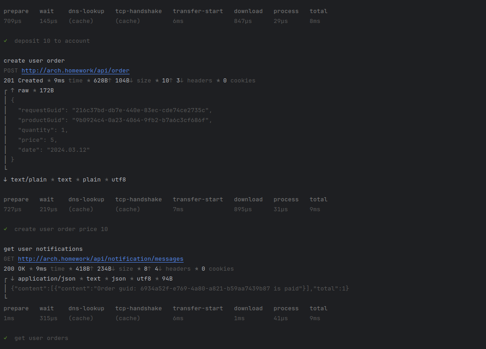
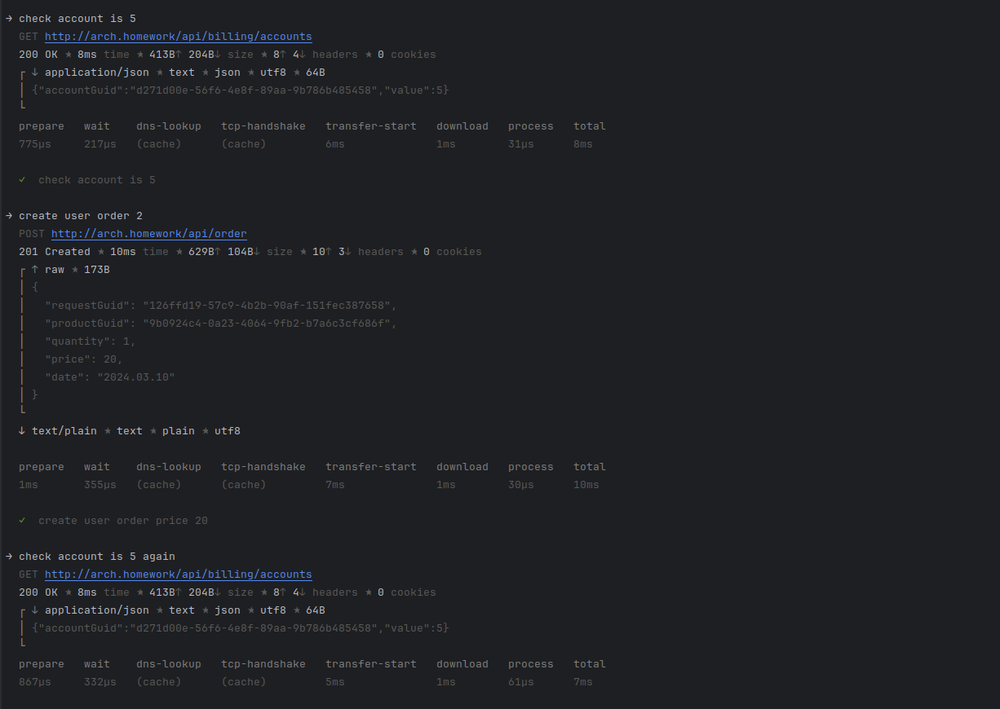
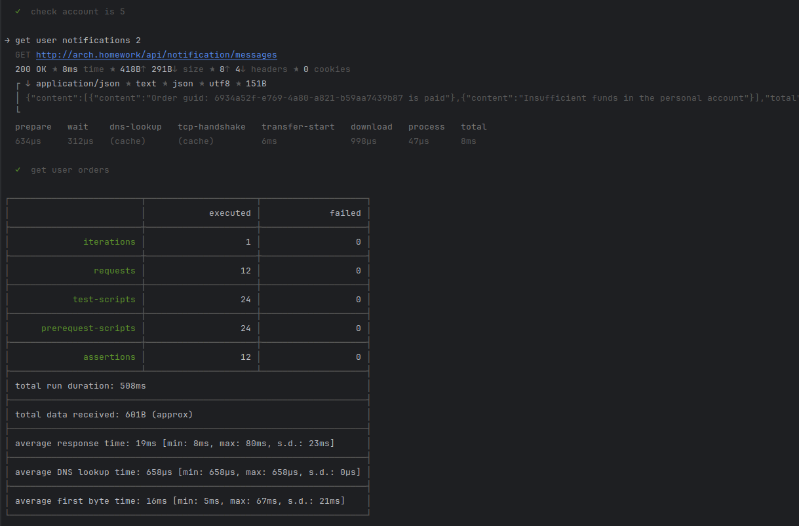

# Instruction
## Before installation
Install minikube, start minikube, ingress addon should be enabled


## Installation
### Install in the following order
1. install postgres database, kafka
    ```shell
    helm upgrade --install database -f postgres/values.yaml oci://registry-1.docker.io/bitnamicharts/postgresql  --create-namespace -n development
    ```
    ```shell
    helm upgrade --install kafka -f kafka/values.yaml oci://registry-1.docker.io/bitnamicharts/kafka --create-namespace -n development
    ```
2. create database, user and password for application need install job
    ```shell
    helm install user-db ./database/user-db -n development
    ```
    ```shell
    helm install auth-db ./database/auth-db -n development
    ```
    ```shell
    helm install order-db ./database/order-db -n development
    ```
    ```shell
    helm install store-db ./database/store-db -n development
    ```
    ```shell
    helm install payment-db ./database/payment-db -n development
    ```
    ```shell
    helm install delivery-db ./database/delivery-db -n development
    ```
    ```shell
    helm install billing-db ./database/billing-db -n development
    ```
    ```shell
    helm install notification-db ./database/notification-db -n development
    ```
3. install apps
    ```shell
    helm upgrade --install user-service ./service/user-service -n development
    ```
    ```shell
    helm upgrade --install auth-service ./service/auth-service -n development
    ```
   ```shell
    helm upgrade --install order-service ./service/order-service -n development
    ```
    ```shell
    helm upgrade --install payment-service ./service/payment-service -n development
    ```
    ```shell
    helm upgrade --install store-service ./service/store-service -n development
    ```
    ```shell
    helm upgrade --install delivery-service ./service/delivery-service -n development
    ```
    ```shell
    helm upgrade --install billing-service ./service/billing-service -n development
    ```
    ```shell
    helm upgrade --install notification-service ./service/notification-service -n development
    ```
## Tests
Run postman collections 
```shell
newman run --verbose otus7.postman_collection.json
```




## Uninstall
* uninstall apps
```shell
helm uninstall user-service -n development
```
```shell
helm uninstall auth-service -n development
```
```shell
helm uninstall order-service -n development
```
```shell
helm uninstall payment-service -n development
```
```shell
helm uninstall store-service -n development
```
```shell
helm uninstall delivery-service -n development
```
```shell
helm uninstall billing-service -n development
```
```shell
helm uninstall notification-service -n development
```
* delete job
```shell
helm uninstall user-db -n development
```
```shell
helm uninstall auth-db -n development
```
```shell
helm uninstall order-db -n development
```
```shell
helm uninstall payment-db -n development
```
```shell
helm uninstall store-db -n development
```
```shell
helm uninstall delivery-db -n development
```
```shell
helm uninstall billing-db -n development
```
```shell
helm uninstall notification-db -n development
```
* uninstall kafka
```shell
helm delete kafka -n development
```
* uninstall postgres database
```shell
helm delete database -n development
```
```shell
#Delete PVC's associated with database
kubectl delete pvc data-database-postgresql-0  -n development
```

##Misc
forward postgres port to local port 5432
```shell
kubectl port-forward --namespace development svc/database-postgresql 5432:5432
```
install redpanda console
```shell
helm repo add redpanda https://charts.redpanda.com
helm repo update
```
```shell
helm upgrade --install redpanda-console redpanda/console -n development -f redpanda-console.yaml
```
* uninstall redpanda-console
```shell
helm delete redpanda-console -n development
```